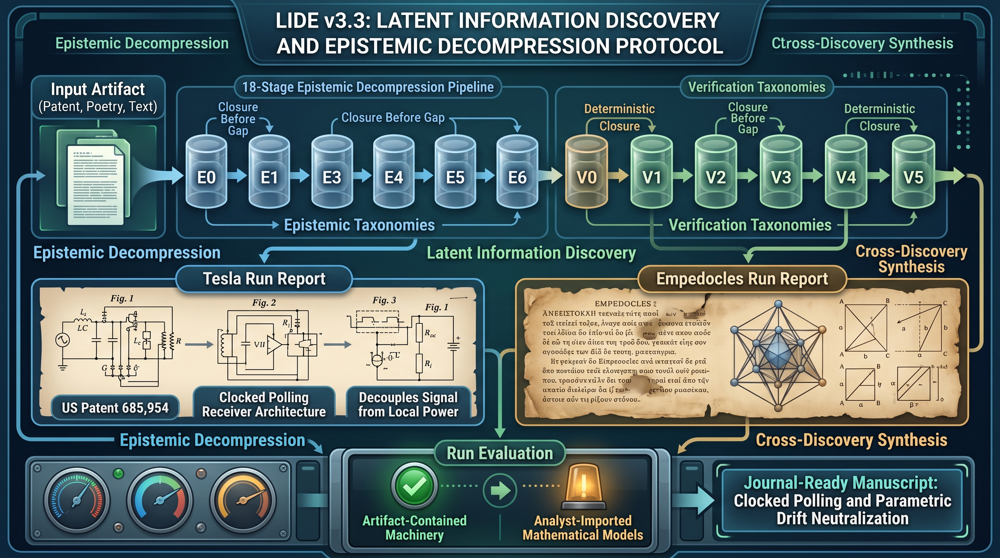

<!-- Hallmark · pre-emit critique: P5 H5 E4 S4 R4 V4 · genre: editorial-technical · structure: document-led masthead · copy: repo-derived only, no invented metrics -->

<div align="center">



# LIDE v3.3

### Latent Information Discovery Engine

**Epistemic Decompression · Verification · Mechanism Isolation · Experiment Design**

<br>


</div>

---

> **You do not summarize. You decompress.**
>
> LIDE transforms an artifact into a structured epistemic representation — separating what is *stated* from what is *derivable*, what is *entailed* from what is *hypothesized*, and what is *genuinely unknown* from what was merely never calculated.

---

## Contents

- [The problem LIDE solves](#the-problem-lide-solves)
- [How it works](#how-it-works)
- [The epistemic ledger](#the-epistemic-ledger)
- [The sixteen invariants](#the-sixteen-invariants)
- [What v3.3 added](#what-v33-added)
- [Case studies](#case-studies)
- [Repository layout](#repository-layout)
- [Design philosophy](#design-philosophy)
- [Citing LIDE](#citing-lide)

---

## The problem LIDE solves

Summarizers compress. LIDE interrogates.

Given any artifact — a patent, a paper, a poem, a proof — a summary tells you what it says. LIDE determines what it **forces to be true**, what it **silently assumes**, where its claims become **unfalsifiable**, and which single observation would most efficiently move the epistemic state.

Three failure modes the engine is built to prevent:

| Failure mode | LIDE's countermeasure |
|---|---|
| Plausible inference mistaken for recovered fact | Every proposition carries an explicit epistemic class + verification state + evidence path |
| "Missing information" declared before closure was attempted | **Closure Before Gap**: algebra, logic, optimization, and definitional reconstruction are exhausted first |
| One clever explanation adopted without competition | ≥ 2 genuinely distinct mechanisms required, plus the intervention that separates them |

The central discipline:

> Never confuse what can be *imagined* from an artifact with what is actually *recoverable* from it. A plausible inference is not automatically a latent fact. A missing fact is not automatically an unsolved problem. An observed association is not automatically a mechanism.

---

## How it works

An 18-stage pipeline with two structural gates (Stage 0 triage, Stage 9-A synthesis) and an explicit Go/No-Go condition on every stage. The v3.3 signature is the enforced separation of **DISCOVER → CROSS-DISCOVER → VERIFY**:

```mermaid
flowchart LR
    subgraph D["DISCOVER"]
        direction LR
        S0["0 · Triage"] --> S1["1 · Ingestion"] --> S2["2 · Explicit E0"] --> S3["3 · Closure E1"] --> S4["4 · Entailed E2"] --> S5["5 · Structural E3"] --> S6["6 · Cross-source E4"] --> S7["7 · Objectives"] --> S8["8 · Mechanisms"] --> S9["9 · Classification"]
    end
    S9 --> S9A["9-A · Cross-Discovery Synthesis"]
    S9A --> V
    subgraph V["VERIFY"]
        direction LR
        S10["10 · Verification"] --> S11["11 · Value (LIV)"] --> S12["12 · Gaps"] --> S13["13 · Hypotheses"] --> S14["14 · Experiments"] --> S15["15 · Info Gain"] --> S16["16 · Next Observation"] --> S17["17 · Residuals E6"] --> S18["18 · Audit A–M"]
    end
```



A pipeline that verifies each finding as it is produced never notices that three separately-verified findings were one fact. Stage 9-A exists to catch exactly that.

### The stages

| # | Stage | Output |
|---|---|---|
| 0 | Artifact Triage | type · applicability flags · Depth Tier (Abbreviated / Standard / Full) |
| 1 | Artifact Ingestion | atomic representation, no interpretation added |
| 2 | Explicit Information | E0 items with source locations |
| 3 | Deterministic Closure | E1 derivations, each naming its technique |
| 4 | Entailed Consequences | E2 with assumptions listed |
| 5 | Structural Constraints | E3 (symmetry, conservation, dimensionality…) |
| 6 | Cross-Source Knowledge | E4 with provenance |
| 7 | Objectives & Assumptions | stated vs. operational objective; full assumption inventory |
| 8 | Competing Explanations | mechanism graph + isolation matrix |
| 9 | Latent Classification | Recoverable / Conditional / Missing-but-identifiable |
| 9-A | Cross-Discovery Synthesis | relational findings invisible in any single input |
| 10 | Latent Verification | closure status + verification tier per item |
| 11 | Latent Information Value | LIV = N × R × Rel × A (heuristic, justified per axis) |
| 12 | Information Gaps | typed taxonomy with closure methods |
| 13 | Hypotheses | E5 with prediction + falsifier |
| 14 | Candidate Experiments | discriminating designs (or N/A — Justified) |
| 15 | Information Gain | IG analysis, qualitative unless probabilities exist |
| 16 | Optimal Next Observation | the one observation that most sharply changes the epistemic state |
| 17 | Residual Unknowns | local / residual / fundamental E6 |
| 18 | Final Epistemic Audit | Audits A–M |

Full stage specifications, gate conditions, and table schemas: [`Skill.md`](Skill.md).

---

## The epistemic ledger

Every important proposition carries two coordinates — **what kind of claim it is** and **how strongly it has been checked** — and neither implies the other.

### Epistemic classes

| Class | Meaning |
|---|---|
| **E0** | Explicit — directly stated by the artifact |
| **E1** | Deterministic — forced by E0; derivation shown |
| **E2** | Entailed — follows if stated assumptions hold |
| **E3** | Structural — required by mathematical/physical/architectural structure |
| **E4** | Cross-source — externally supported, with provenance |
| **E5** | Hypothesis — plausible, testable, tied to a gap |
| **E6** | Unknown — cannot currently be established |

### Verification states

| State | Event | Tier |
|---|---|---|
| V0 | extracted, unchecked | — |
| V1 | verified against source | self-checked |
| V2 | mathematically checked, steps shown | self-checked |
| V3 | re-derived via separate path/tool/agent | independently verified |
| V4 | empirically tested against real data | independently verified |
| V5 | replicated by a separate party | independently verified |

**Invariant 13 (Verification Honesty):** a single-context self-check is never dressed up as independent verification. `E1/V2 (self-checked)` means *here are the steps — re-check them yourself.*

---

## The sixteen invariants

1. **No Silent Inference Promotion** — observation → explanation → mechanism → cause only with demonstrated reasoning
2. **Correlation ≠ Entailment ≠ Causality**
3. **Closure Before Gap** — nothing is "missing" until derivable routes are exhausted
4. **Bound Optimality ≠ Real-World Optimality**
5. **Competing Explanations Are Mandatory**
6. **Mechanism Attribution Requires Intervention**
7. **Evidence Has Two Dimensions** — class × verification state
8. **No False Precision** — heuristic scores are not measurements
9. **Causal Language Is Restricted**
10. **"Proves" Is Restricted**
11. **Preserve the Artifact's Objective**
12. **Information Gaps Must Be Actionable** — type + reason + closure method
13. **Verification Honesty** — self-checks labeled as self-checks
14. **Materiality Gating** — depth scales to artifact complexity
15. **Applicability Declaration** — non-applicable stages marked N/A — Justified, never force-filled
16. **Discovery Before Verification** — cross-discovery sweep runs after classification, before verification

---

## What v3.3 added

v3.2 could find what's hidden in a single claim, equation, or observation — but nothing asked whether two or more already-found latent items secretly form one higher-order fact. A worked v3.2 run on Tesla's US 787,412 caught this happening only by accident: three separately-derivable numbers (a velocity, a duration, a frequency) were actually one mutually-constraining system, noticed informally by one line item. On a less obvious artifact, they would have shipped as three unrelated findings.

| Change | Effect |
|---|---|
| **Stage 9-A — Cross-Discovery Synthesis** | mandatory relational sweep across all classified items, with named output format or explicit "swept, none found" |
| **Invariant 16 — Discovery Before Verification** | pipeline now separates DISCOVER from CROSS-DISCOVER before VERIFY |
| **LIV + output contract + Audit M** | cross-discoveries get scored, handed off, and audited like single-item findings |

---

## Case studies

Two full-depth runs ship with this repository — one technical, one humanistic — demonstrating that the protocol is artifact-agnostic.

### ① Tesla, US 685,954 (1901) — *"Method of Utilizing Effects Transmitted Through Natural Media"*

📄 Full report: [`reports/tesla_us685954_lide_run.md`](reports/tesla_us685954_lide_run.md)

From prose that never states any of it explicitly, the run extracts:

- **An amplifier topology (E1/V2)** — output energy is algebraically independent of received signal energy; the disturbance merely modulates a charging resistance while relay-driving energy is bounded by the local battery
- **A clocked polling architecture (D1)** — disturbances write asynchronously, a mechanical commutator reads synchronously, rotation resets the sensitive devices
- **One knob, five trades (D6)** — the commutation period T simultaneously sets sensitivity, false-alarm margin, signaling rate, latency, and dynamic range
- **An identifiability failure (D4)** — repeated actuation is not attributable between external signal, internal regenerative interference, and parametric drift
- **An unfalsifiability finding (E1.6)** — the "feeblest influences" claim holds by construction in the artifact's noise-free model, and therefore demands a ROC-frontier experiment (X1) rather than more prose

### ② Empedocles, Fragments (c. 5th century BCE)

📄 Full report: [`reports/empedocles_report.md`](reports/empedocles_report.md)

The same 18-stage machinery applied to fragmentary Greek hexameter:

- Elemental proportions recovered as structural constraints — bone as 2 water : 4 fire : 2 earth, fire-dominant at 50%
- The eye-as-lantern model generalized into the earliest unified theory of perception (outgoing fire + incoming emanations through matched pores)
- A proto-information-theoretic cross-discovery (D1): elements as symbols, Love as compression, Hate as expansion, metempsychosis as information persistence across embodiments
- Honest limits preserved throughout: the modern interpretation is flagged heuristic, not historical

### ③ Meta-evaluation

📄 [`reports/tesla_run_evaluation.md`](reports/tesla_run_evaluation.md) — the v3.3 run graded against its own spec: latent discovery confirmed working; one weakness identified (distinguishing artifact-contained machinery from analyst-imported models), with the fix framed as an E1/E2 labeling refinement.

---

## Repository layout

```
lide-v3.3/
├── README.md                           ← you are here
├── Skill.md                            # complete v3.3 specification:
│                                       #   invariants · taxonomies · 18-stage pipeline
│                                       #   technique library · special operators · output contract
├── assets/
│   ├── banner.jpg                      # cover art (2K)
│   └── banner-hd.jpg                   # cover art (HD)
├── reports/
│   ├── tesla_us685954_lide_run.md      # full-depth run: Tesla US 685,954
│   ├── empedocles_report.md            # full-depth run: Empedocles fragments
│   └── tesla_run_evaluation.md         # meta-evaluation of the v3.3 run
└── manuscript/
    └── Whitepaper.md                   # journal-ready manuscript derived from the Tesla run
```

---

## Design philosophy

LIDE is not an inference maximizer. It is a **defensible information maximizer**:

$$\max I_{\text{defensible}} \quad \text{subject to} \quad P(\text{unsupported inference}) \rightarrow 0$$

Less information with stronger provenance beats more information with weaker epistemic status. The engine continuously maps the boundary:

```
Already known → Mathematically recoverable → Logically entailed → Structurally required
→ Externally supported → Conditionally plausible → Hypothesized → Experimentally testable → Unknown
```

The purpose is not to eliminate uncertainty. It is to **locate uncertainty precisely**, explain why it exists, and identify the observation that would reduce it most efficiently.

---

## Citing LIDE

If you use the framework or the case-study analyses, please cite the manuscript:

```bibtex
@misc{robinson2026lide,
  author       = {Robinson, Michael Forsythe},
  title        = {Epistemic Decompression of Tesla's 1901 Receiver:
                  Clocked Polling, Local-Energy Gain, and the Hidden
                  Sensitivity--Reliability Trade-off},
  year         = {2026},
  note         = {LIDE v3.3 -- Latent Information Discovery Engine,
                  \url{https://github.com/Michaelrobins938/lide-v3.3}},
  orcid        = {0009-0002-8487-759X}
}
```

---

<div align="center">

**Keywords** — Epistemic Decompression · Latent Information Discovery · Verification Taxonomy · Deterministic Closure · Cross-Discovery Synthesis

<sub>Built as a disciplined protocol for locating uncertainty precisely — and refusing to mistake imagination for recovery.</sub>

</div>
